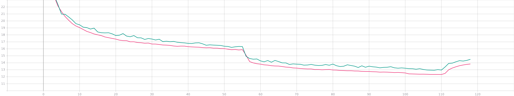
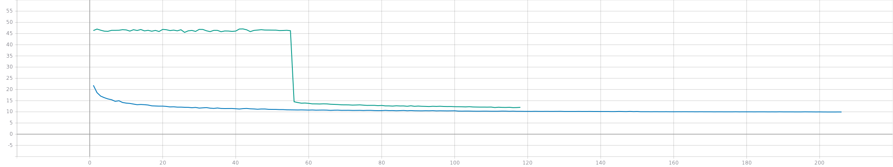
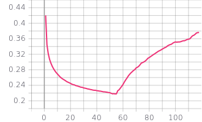
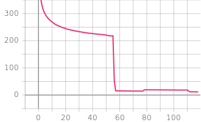

# ASFM-Net-Pytorch

***Status: Done***

This is an **unofficial** implement of ASFM-Net, and I have achieved CD-P ***11.87*** at PCN datasets.🚀

Official repo: https://github.com/Yan-Xia/ASFM-Net

## Preparation

**pytorch > 1.10.1 required!**

1. Complie Chamfer3D, code from https://github.com/AllenXiangX/SnowflakeNet
```
cd Chamfer3D
python setup.py --user install
```
2. Complie pointnet++ which includes ***fps_sampling*** we need, code from https://github.com/AllenXiangX/SnowflakeNet
```
cd pointnet2_ops_lib
python setup.py --user install
```
3. Dataset path configs at config_pcn.py, modify it refer to https://github.com/hzxie/GRNet
```
__C.DATASETS.SHAPENET.PARTIAL_POINTS_PATH = '/home/chriskafka/dataset/ShapeNetCompletion/%s/partial/%s/%s/%02d.pcd'
__C.DATASETS.SHAPENET.COMPLETE_POINTS_PATH = '/home/chriskafka/dataset/ShapeNetCompletion/%s/complete/%s/%s.pcd'
```
Note that I am using gradient accumulation to simulate a big batchsize(32 in paper), You can set `accumulation_steps = 1` in train_*.py under core directoroies to cancel this.

## Run
0. Install and run tensorboard(optional):
```
https://www.tensorflow.org/tensorboard/get_started?hl=zh-cn
```
1. Step1: Pretrine PCN.
bs 32, 206 epochs, CD Loss descended to 9.917
```
python main_pcn.py --baseline
```
2. Step2: Modify __C.CONST.PCNWEIGHTS in config_pcn.py to direct to pre-trained models obtained in step1, 
```
__C.CONST.PCNWEIGHTS = 'checkpoint/pcn-baseline-best.pth'
```
train ASFM-net.
```
python main_pcn.py --backbone
```
bs 32, 116 epochs, CD Loss descended to 11.87(12.09 in paper).

## Results
1. Coarse cd loss represention of step2, red for train loss while green for test.




2. Fine cd loss represention, green for test in step2 while blue for test in step1.





3. Feature Matching loss represention of step2.




4. Total loss represention of step2.



## Thanks To
PCN pytorch implementation refers to https://github.com/paul007pl/VRCNet.

Point Clouds Utils(FPS, CD) borrowed from https://github.com/AllenXiangX/SnowflakeNet.

Data precessing codes comes from https://github.com/hzxie/GRNet.

And thanks [ASFM-Net](https://github.com/Yan-Xia/ASFM-Net) for their contributions.

If you have any ***suggestions or ideas*** about my work, feel free to ***refer a issue even a pr*** to keep me informed, thanks again.
